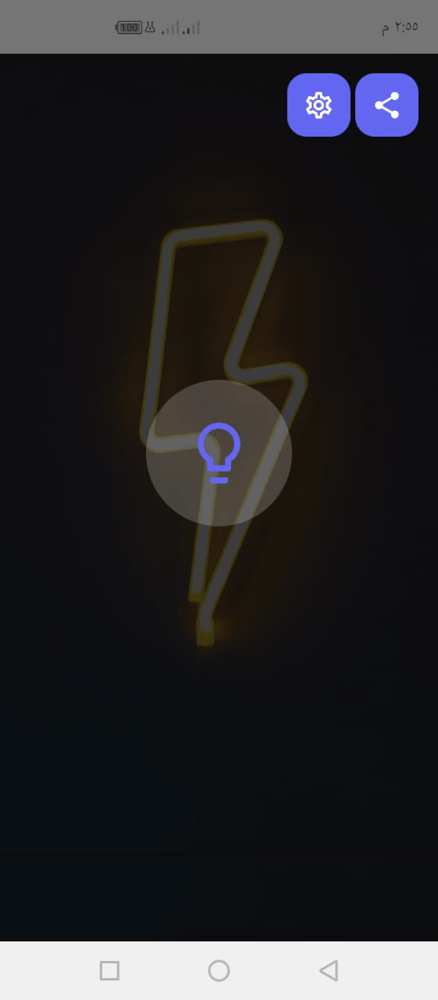
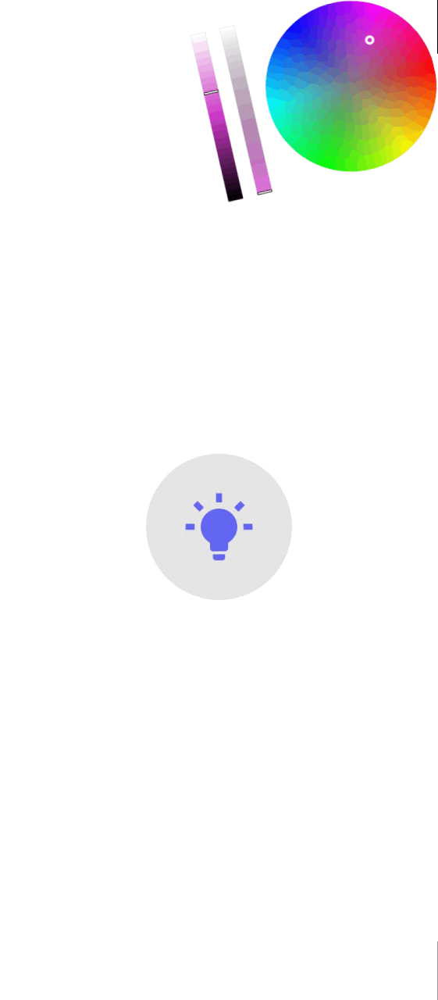
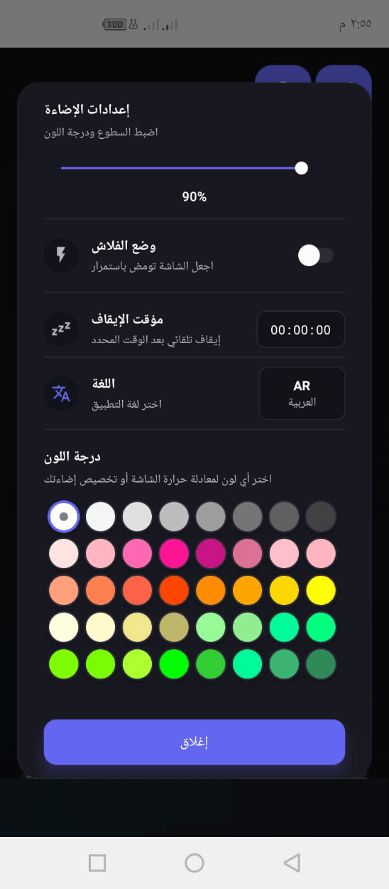

# Screen Light

Transform your screen into a powerful white light source with full control over brightness, color tones, and timing.

[](https://play.google.com/store/apps/details?id=com.xcodes.screenlight)

## 📱 Application Screenshots

<p align="center">
  
  
  
  
</p>

---

## Features

- ⚡ **Maximum Brightness Control** - Set screen brightness to maximum with precise control
- 🎨 **Color Tone Customization** - Choose from 40 colors to adjust screen tone
- ⏰ **Sleep Timer** - Auto turn-off after selected duration (5s to 24h)
- 📱 **Flash Mode** - Continuous blinking light effect
- 🌍 **20 Languages** - Full multilingual support with RTL (Arabic, Persian, Urdu)
- 💾 **Settings Persistence** - All preferences saved locally
- 🔋 **Power Saver Detection** - Alerts when device settings may affect brightness
- 🎯 **Clean Architecture** - Modular design with custom hooks and separated concerns

---

## Project Structure

```
App/
├── android/                    # Android native code
├── ios/                        # iOS native code
│   └── app/src/main/java/      # Native modules (BrightnessModule)
├── src/
│   ├── components/             # Reusable UI components
│   │   ├── common/             # Shared components (AppText, AdBanner)
│   │   └── main/               # Main screen components
│   ├── screens/                # Screen compositions
│   │   ├── MainScreen.jsx      # Main white light screen
│   │   ├── SplashScreen.jsx    # Animated splash screen
│   │   └── mainScreenHandlers.js # Screen-specific handlers
│   ├── navigation/             # Navigation setup
│   │   └── AppNavigator.jsx    # Stack navigator configuration
│   ├── hooks/                  # Custom React hooks
│   │   ├── useLamp.js          # Lamp on/off state management
│   │   ├── useSettings.js      # Settings state and persistence
│   │   ├── useSleepTimer.js    # Sleep timer countdown logic
│   │   ├── usePowerSaverWarning.js # Battery saver monitoring
│   │   └── useBrightnessSync.js # Brightness synchronization
│   ├── services/               # Business logic and native bridges
│   │   ├── brightnessService.js # Native brightness module bridge
│   │   └── settingsStorage.js  # SQLite storage wrapper
│   ├── i18n/                   # Internationalization
│   │   ├── index.js            # i18next configuration
│   │   ├── languages.js        # Supported languages list
│   │   ├── languageManager.js  # Language switching logic
│   │   └── locales/            # Translation files (20 languages)
│   ├── config/                 # App configuration
│   │   └── theme.js            # Design tokens (colors, spacing, typography)
│   ├── utils/                  # Utility functions
│   │   ├── formatters.js       # Time formatting utilities
│   │   └── backButtonHandler.js # Android back button logic
│   └── assets/                 # Images and static resources
└── __tests__/                  # Unit tests
```

---

## Technology Stack

### Core Framework

- **React Native 0.83.1** - Cross-platform mobile framework
- **React 19.2.0** - UI library
- **React Native CLI** - Native development toolchain

### Navigation

- **@react-navigation/native** - Navigation framework
- **@react-navigation/native-stack** - Native stack navigation
- **react-native-screens** - Native screen optimization
- **react-native-safe-area-context** - Safe area handling

### Internationalization

- **i18next** - Translation engine
- **react-i18next** - React bindings for i18n
- **react-native-localize** - Device locale detection
- **react-native-restart** - App restart functionality for RTL/LTR direction changes

### Storage & State

- **react-native-sqlite-storage** - Local SQLite database for settings
- **@react-native-community/netinfo** - Network connectivity detection

### UI & Animations

- **react-native-reanimated** - High-performance animations
- **react-native-gesture-handler** - Touch gesture handling
- **@react-native-community/slider** - Slider component
- **react-native-vector-icons** - Icon library (MaterialCommunityIcons)

### Native Modules

- **Custom BrightnessModule** - Native Android module for:
  - Screen brightness control
  - System brightness reading/writing
  - Keep screen on flag management
  - Immersive mode (fullscreen)
  - Power saver detection
  - Auto-brightness detection

---

## Design System

### Design Tokens (`config/theme.js`)

```javascript
COLORS; // Color palette (background, surface, primary, text)
SPACING; // 8pt grid system (xxs: 2, xs: 4, sm: 8, md: 12, lg: 16, xl: 24, xxl: 32)
TYPOGRAPHY; // Text styles (heading, body, button, caption)
SIZES; // Component sizes (icons, buttons, modals, z-index)
SHADOWS; // Shadow effects (sm, md, lg, button, warning)
```

### Design Principles

- All colors, spacing, and styles use design tokens
- No hardcoded values in components
- All text content uses i18n translations
- Components follow single responsibility principle
- Business logic separated in custom hooks

---

## Supported Languages

The app supports 20 languages with full RTL (right-to-left) support:

### RTL Languages (3)

- 🇸🇦 **Arabic** (ar) - العربية
- 🇮🇷 **Persian** (fa) - فارسی
- 🇵🇰 **Urdu** (ur) - اردو

### LTR Languages (17)

- 🇬🇧 English (en)
- 🇧🇩 Bengali (bn) - বাংলা
- 🇩🇪 German (de) - Deutsch
- 🇬🇷 Greek (el) - Ελληνικά
- 🇪🇸 Spanish (es) - Español
- 🇫🇷 French (fr) - Français
- 🇮🇳 Hindi (hi) - हिन्दी
- 🇮🇩 Indonesian (id) - Bahasa Indonesia
- 🇮🇹 Italian (it) - Italiano
- 🇯🇵 Japanese (ja) - 日本語
- 🇰🇷 Korean (ko) - 한국어
- 🇳🇱 Dutch (nl) - Nederlands
- 🇧🇷 Portuguese (pt) - Português
- 🇷🇺 Russian (ru) - Русский
- 🇸🇪 Swedish (sv) - Svenska
- 🇹🇷 Turkish (tr) - Türkçe
- 🇨🇳 Chinese (zh) - 中文

### Language Switching

- **Automatic RTL/LTR layout switching** - Changes text direction based on language
- **App restart on direction change** - Uses `react-native-restart` to fully restart app when switching between RTL and LTR languages
- **Persistent language selection** - Language preference saved to SQLite and restored on app launch
- **Instant language update** - Language changes immediately in the UI without restart when switching between same-direction languages (e.g., English → French)

**How it works:**

1. User selects new language from Settings Modal
2. System detects if direction change is needed (RTL ↔ LTR)
3. **Same direction languages** (e.g., English → French): Language updates instantly in real-time without app restart
4. **Different direction languages** (e.g., English ↔ Arabic): App automatically restarts using `RNRestart.restart()` to apply layout direction changes
5. Relaunches with new language and direction applied

---

## Custom Hooks

The project uses custom hooks to separate business logic from UI components:

- **`useLamp()`** - Manages lamp on/off state and brightness control
- **`useSettings()`** - Handles all app settings with SQLite persistence
- **`useSleepTimer()`** - Sleep timer countdown logic
- **`usePowerSaverWarning()`** - Monitors battery saver and auto-brightness status
- **`useBrightnessSync()`** - Syncs brightness level when lamp is active

---

## Native Modules

### BrightnessModule (Android)

Custom native Android module located in `android/app/src/main/java/` that provides:

- Screen brightness control (read/write)
- Maximum brightness mode
- Keep screen awake flag
- Fullscreen immersive mode
- Battery saver detection
- Auto-brightness status checking
- System display settings integration

---

## Screens Overview

### Splash Screen (`src/screens/SplashScreen.jsx`)

Animated introduction screen that appears on app launch:

**Features:**

- Cinematic light sweep animation effects
- App icon with glow and scaling animations
- 4-second total duration (ignition → reveal → hold → exit)
- Spotlight bloom behind logo
- Grain and vignette overlays for premium feel
- Automatic navigation to Main Screen
- Uses React Native Reanimated for smooth animations

---

### Main Screen (`src/screens/MainScreen.jsx`)

The primary screen where users control the white light:

#### OFF State (Default)

**Visual:**

- Dark themed background with gradient colors
- Lamp circle button in center (lightbulb-outline icon)
- Floating action buttons in top-right:
  - Settings button (cog icon)
  - Share button (share icon)
  - Power saver warning (if active)

**Behavior:**

- Normal screen brightness
- Status bar visible
- Screen can sleep normally
- All settings accessible via settings modal

#### ON State (Lamp Active)

**Visual:**

- Pure white background (`#FFFFFF`) fills entire screen
- Lamp circle button shows filled lightbulb icon
- Optional color tone overlay (if selected)
- Flash indicator badge (if flash mode enabled)
- Sleep timer countdown display (if timer set)
- Status bar hidden (immersive mode)

**Behavior:**

- Screen brightness set to maximum
- Keep screen awake flag enabled
- Fullscreen immersive mode active
- Color tone applied as overlay
- Flash mode creates blinking effect (if enabled)
- Sleep timer counts down and auto-turns off lamp

#### Settings Modal

Modal dialog accessible from settings button:

**Brightness Control Section:**

- Slider component (0-100%)
- Real-time brightness adjustment
- Current percentage display

**Flash Mode Section:**

- Toggle switch for flash mode
- Creates continuous blinking when ON
- Works only when lamp is active

**Sleep Timer Section:**

- Duration picker modal
- Options: Off, 5s-45s, 1m-30m, 1h-24h
- Displays in HH:MM:SS format
- Timer starts when lamp turns ON

**Color Tone Section:**

- Grid of 40 color options
- Circular color swatches
- Selected color highlighted with border
- Only visible when lamp is OFF
- Applied as overlay when lamp turns ON

**Language Section:**

- Language selector showing current language name
- Modal with all 20 language options
- Selected language marked with checkmark
- **Instant language update** - Language changes appear immediately in real-time without app restart for same-direction languages
- **Automatic app restart** when switching between RTL (Arabic, Persian, Urdu) and LTR languages
- Shows "Language changed. App will restart..." confirmation alert before restarting (only for direction changes)
- Uses `react-native-restart` for complete app restart to apply direction changes

---

## Installation

### Prerequisites

- Node.js >= 20
- React Native development environment
- Android Studio and SDK
- JDK 17+

### Setup

1. **Clone the repository**

```bash
git clone <repository-url>
cd App
```

2. **Install dependencies**

```bash
npm install
```

3. **Install iOS dependencies (if needed)**

```bash
cd ios && pod install && cd ..
```

4. **Start Metro bundler**

```bash
npm start
```

5. **Run on Android**

```bash
npm run android
```

---

## Development Scripts

```bash
npm start           # Start Metro bundler
npm run android     # Build and run on Android
npm run ios         # Build and run on iOS (if supported)
npm run lint        # Run ESLint
npm test            # Run Jest tests
```

---

## Build Configuration

### Android Build Types

- **Debug** - Test ads enabled, debugging features
- **Release** - Production ads, optimized build

### Native Dependencies

All native dependencies are auto-linked via React Native CLI.

For manual linking or troubleshooting:

```bash
cd android && ./gradlew clean && cd ..
npm run android
```

---

## State Management

### Local State

- React hooks (`useState`, `useEffect`) for component-level state
- Custom hooks for shared logic

### Persistent State

- SQLite database via `react-native-sqlite-storage`
- Settings table with key-value storage
- Automatic save/load on mount/change

### Settings Keys

```javascript
brightnessLevel; // float (0.0-1.0)
colorTone; // string (hex color)
flashEnabled; // boolean
sleepDuration; // number (seconds)
language; // string (language code)
```

---

## Code Quality

### Conventions

- **Component naming** - PascalCase (`MainScreen.jsx`)
- **Hook naming** - camelCase with 'use' prefix (`useLamp.js`)
- **File organization** - Features grouped by domain
- **Imports** - Organized by: React, third-party, local

### ESLint

The project uses `@react-native/eslint-config` for code linting.

Run linter:

```bash
npm run lint
```

### Code Structure Principles

1. **Single Responsibility** - Each component/hook has one job
2. **Token-based Design** - No hardcoded values
3. **Composition over Inheritance** - Build complex UIs from simple parts
4. **Custom Hooks** - Extract reusable logic
5. **Service Layer** - Separate business logic from UI

---

## Troubleshooting

### Brightness not changing

- Check if Auto-brightness is enabled (app will warn)
- Check if Battery Saver is active (app will warn)

### App doesn't restart after language change

**Verification Checklist:**

- ✅ `react-native-restart` package is installed (`npm install react-native-restart`)
- ✅ Language direction actually changes (RTL ↔ LTR switch)
- ✅ Automatic restart only triggers on direction change, not on same-direction language switches

**Manual Testing:**

1. Open Settings Modal
2. Switch from English (LTR) to Arabic (RTL)
3. App should restart automatically within 2 seconds
4. Verify Arabic is displayed with RTL layout on app relaunch

---

## Architecture Highlights

### Separation of Concerns

- **Screens** - Thin composition layer
- **Components** - Reusable UI building blocks
- **Hooks** - Reusable business logic
- **Services** - Side effects and native bridges
- **Utils** - Pure utility functions
